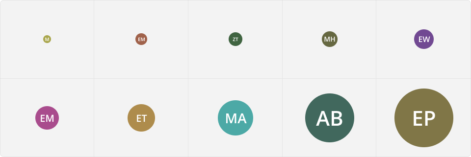

# Avatar

Uma avatar é uma representação visual de uma pessoa, exibido em uma caixa totalmente circular e sempre mantendo-se a proporção `1:1`. É comumente utilizado para exibir o próprio usuário em um cabeçalho de sistema, ou também para exibir imagens referentes a outros usuários em tabelas e dados sobre estes indivíduos.

Normalmente exibe-se a imagem que a própria pessoa escolheu ao fazer _upload_ como seu avatar (também chamada de imagem de perfil), mas se adapta para exibir iniciais a partir do nome, ao invés de uma imagem caso necessário, ou ainda um ícone de usuário padrão caso não seja possível exibir iniciais.

<LinkToCpsElements name="avatar" />

## Variações

Este componente pode ser utilizado conforme as variações descritas a seguir.

### Com imagem

Quando há uma imagem referente à pessoa em questão, normalmente uma imagem de perfil previamente enviada pelo próprio usuário representado pela instância de avatar em questão. É impreterível que a imagem seja posicionada de forma a preencher proporcionalmente toda a área do avatar, para que a proporção de `1:1` seja mantida, utilizando-se técnicas como `background-size: cover` no CSS.

### Com iniciais

Quando não é imagem para exibir no avatar, deve-se utilizar o nome completo do indivíduo para inferir as iniciais em maiúsculas a partir da primeira palavra (comumente primeiro nome) e da última palavra (comumente o sobrenome) deste nome. Caso apenas uma palavra tenha sido fornecida como nome, apenas uma inicial será exibida.

### Com ícone padrão

Caso não seja possível inferir iniciais, seja pela ausência de nome ou pela existência de caracteres não alfabéticos no nome, utiliza-se o ícone padrão de usuário como nome.

## Boas práticas

Para que este componente seja utilizado da melhor maneira possível, observe as práticas a seguir.

### Exibição e comportamento

Use avatar com menos de `24px` em situações raras e específicas, dada a dificuldade de visualização tanto da imagem quanto das inicias em um tamanho muito reduzido.

Use avatar de `24px` dentro de campos de texto em modo somente leitura, ou dentro de experiências similares a tabelas com colunas que precisam de representações compactas de pessoas.

Use avatar de `32px` em campos de texto em modo de edição.

Use avatar de `32px` a `48px` em menus e exibições de lista, conforme a densidade de informação desejada.

Use avatar de `72px` a `100px` como imagem central de cartões de perfil e similares.

### Cores

Quando não há uma imagem de perfil definida, o avatar não deve ter uma cor de fundo estática, pois isto dificultaria identificar rapidamente pessoas diferentes. Para isso, recomenda-se que os avatares baseados em inicias sigam alguma lógica de geração de cores a partir do nome, como neste exemplo:

<AvatarGenerator />

### Acessibilidade

Por padrão, locais que utilizam avatares não exibem detalhes adicionais sobre o indivíduo, como seu nome completo, o que pode gerar confusão sobre quem é uma pessoa apenas a partir da foto de perfil (ou pior, no caso de apenas iniciais estarem em exibição). Assim, quando não houver espaço para exibir detalhes do indivíduo próximo ao seu avatar, recomenda-se a utilização de _tooltip_ exibindo o nome completo ao se posicionar o ponteiro sobre o avatar.
