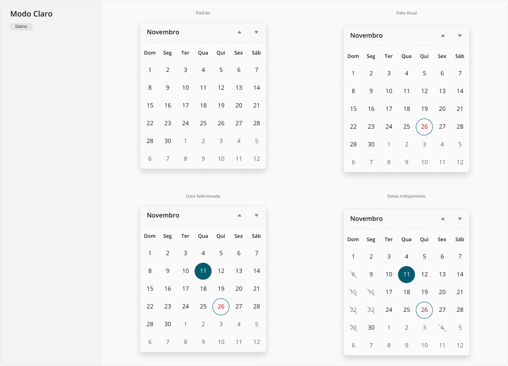
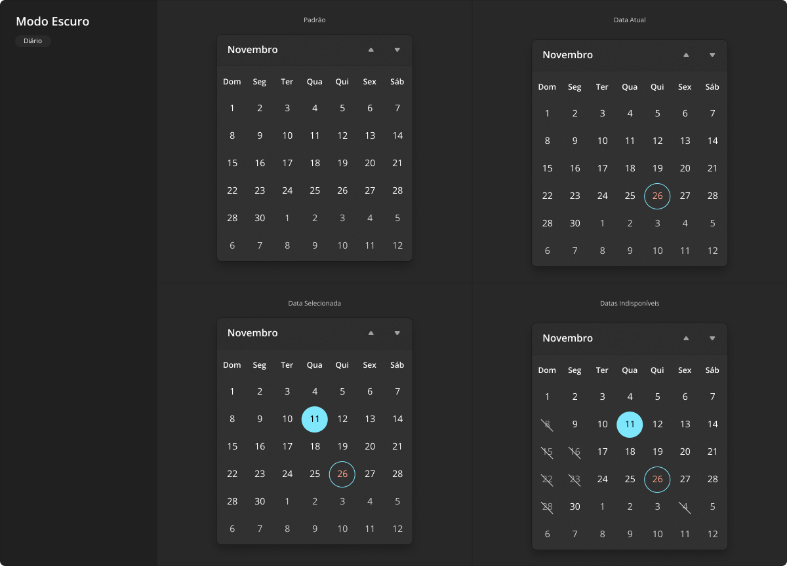
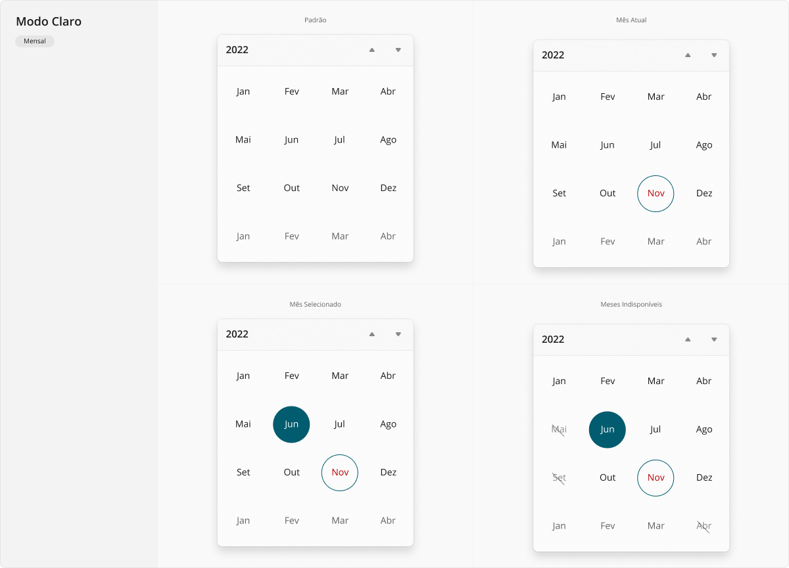
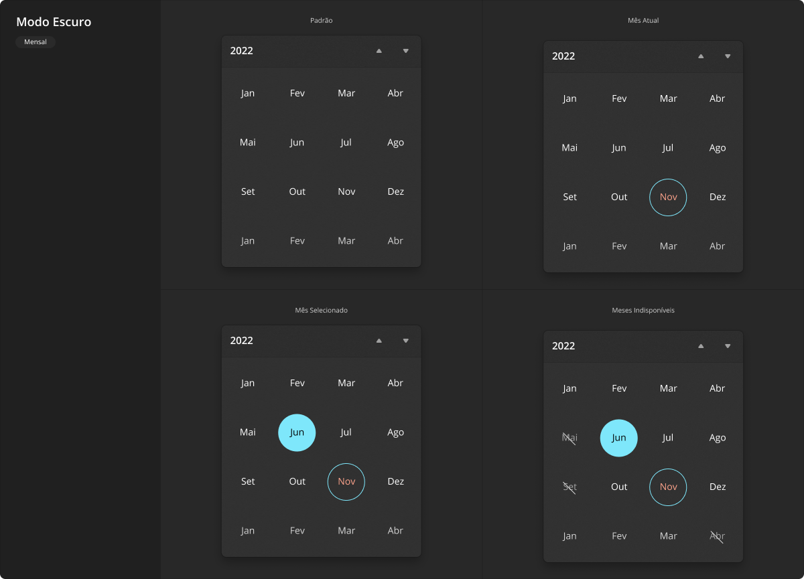
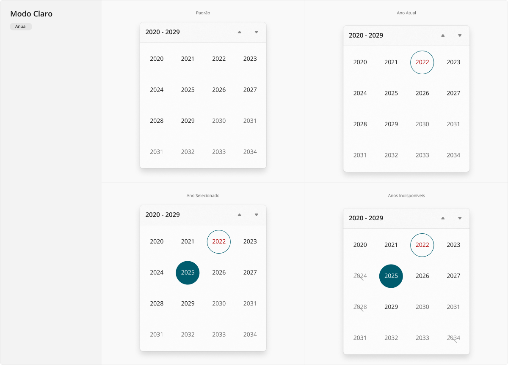
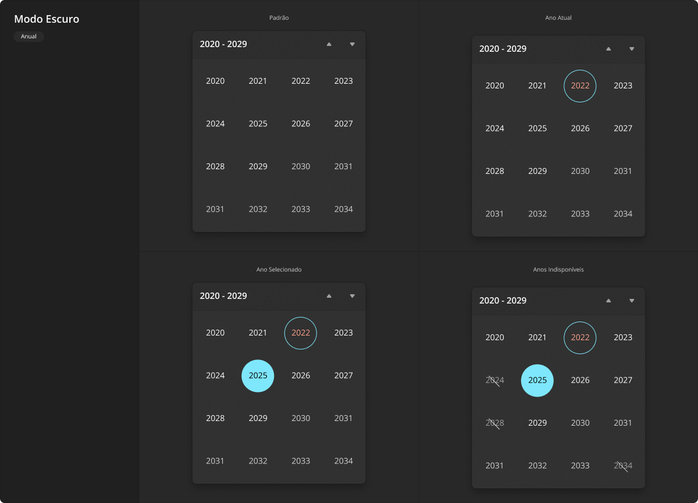

# Calendar

Um calendário é um componente certamente auto-explicativo, assemelhando-se bastante à sua contraparte do mundo físico (principalmente em sua variação diária). Uma visualização de calendário permite que um usuário visualize e interaja com um dias, meses e ano, potencialmente podendo navegar por mês, ano ou década. Apesar das possibilidades de interação, também é válido como um componente estático para apresentação visual de uma data na interface.

<LinkToCpsElements name="calendar" />

## Variações

Este componente pode ser utilizado conforme as variações descritas a seguir.

### Diário

Passível de ser considerada a variação padrão de um calendário, por ser sua forma comum no mundo físico, um calendário diário permite visualizar vários dias de um mês, bem como a "sobra" de dias dos meses anterior e próximo, caso as primeiras e/ou últimas semanas do mês não sejam completas.

A aparência desta variação em modo claro:

A aparência desta variação em modo escuro:

Os botões de navegação entre meses podem ser escondidos, no caso de um calendário estático somente para visualização. Entretanto, no caso de um calendário habilitado para seleção de uma ou mais datas, clicar/tocar no cabeçalho do componente (no nome do mês atualmente visível) deve alternar o calendário para a próxima variação, para permitir visualizar todos os meses.

### Mensal

Esta variação do calendário não é utilizada com frequência como sua visualização padrão, embora seja possível. Em geral, é acessada conforme anteriormente mencionado, ao acionar-se o nome do mês atualmente visível, quando a variação diária está vigente. Um calendário mensal permite visualizar vários meses de um ano, bem como a "sobra" de meses iniciais do ano seguinte, uma estratégia utilizada para garantir que o tamanho do calendário permaneça o mesmo entre variações.

A aparência desta variação em modo claro:

A aparência desta variação em modo escuro:

Os botões de navegação entre anos podem ser escondidos, no caso de um calendário estático somente para visualização. Entretanto, no caso de um calendário habilitado para seleção de um ou mais meses, clicar/tocar no cabeçalho do componente (no nome do mês atualmente visível) deve alternar o calendário para a próxima variação, para permitir visualizar vários anos de uma única vez.

### Anual

Esta variação do calendário não é utilizada com frequência como sua visualização padrão, embora seja possível. Em geral, é acessada conforme anteriormente mencionado, ao acionar-se o nome do ano atualmente visível, quando a variação mensal está vigente. Um calendário anual permite visualizar vários anos organizados por década, bem como a "sobra" de anos iniciais da década seguinte, uma estratégia utilizada para garantir que o tamanho do calendário permaneça o mesmo entre variações.

A aparência desta variação em modo claro:

A aparência desta variação em modo escuro:

Os botões de navegação entre décadas podem ser escondidos, no caso de um calendário estático somente para visualização. Entretanto, no caso de um calendário habilitado para seleção de um ou mais anos, clicar/tocar no cabeçalho do componente (no nome da década atualmente visível) deve alternar o calendário de volta para a variação anterior, para permitir voltar a visualizar meses do ano atualmente selecionado (ou do ano corrente, na falta de um ano selecionado).

## Boas práticas

Para que este componente seja utilizado da melhor maneira possível, observe as práticas a seguir.

### Exibição e comportamento

Calendários devem obedecer a medida mínima de `20rem` de largura por `22rem` de altura, dimensões que garantem a proporção adequada dos elementos e uma dimensão minimamente adequada dos itens para operação tanto por _mouse_ quanto por _touch_. Mas preferencialmente estas medidas devem ser mantidas mesmo em cenários onde haja mais espaço, para evitar distorções de espaçamento que podem gerar um efeito desagradável.

Cada item dentro do calendário (cada dia, mês ou ano, dependendo da variação ativa) é um sub-componente por si só, devendo ter exatamente as mesmas características visuais e comportamentais de um [Button](./button.md) em sua variação apenas com ícone (ainda que não sejam ícones em exibição no calendário, esta variação do botão é a que apresenta os melhores visuais para os diferentes estados quando o item do calendário está sendo manipulado).

A maior parte dos calendários existe para seleção de dias específicos. Neste caso, as variações mensal e anual não apenas selecionam o item acionado (um mês ou um ano, respectivamente), mas também automaticamente devem alternar o _layout_ para a variação mais específica, para permitir que o usuário rapidamente continue selecionando items até chegar à data específica desejada. Por exemplo, o usuário pode estar visualizando a variação anual com a década de `2020-2029` ativa, ao selecionar o ano de `2022`, imediatamente deve ver a variação mensal com o ano selecionado ativo, podendo então selecionar o mês `Jul`, assim imediatamente deve ver a variação diária com o mês selecionado ativo, podendo por fim selecionar o dia `31`, o que resultará internamente no valor selecionado `"2022-07-31"` (em formato [ISO 8601](https://pt.wikipedia.org/wiki/ISO_8601)).

Para fins de compreensão da usabilidade e da aparência de todos os sub-componentes do calendário (a área de cabeçalho com o nome do mês/ano/década atualmente visível, os botões de navegação para cima e baixo, e cada um dos itens do calendário, ou seja, dias/meses/anos ali exibidos), apoiar-se no componente [Button](./button.md), especificamente sua variação apenas com ícone, ainda que a maioria dos sub-componentes do calendário sejam números ou palavras, ao invés de ícones.

### Acessibilidade

O calendário em si não possui características próprias de acessibilidade. Mas cada um dos sub-componentes ali contidos (a área de cabeçalho com o nome do mês/ano/década atualmente visível, os botões de navegação para cima e baixo, e cada um dos itens do calendário, ou seja, dias/meses/anos ali exibidos), devem aplicar corretamente todos os diferentes estados de interação quando em uso: `:hover` para movimentação do _mouse_ sobre o sub-componente, `:active` para o exato momento em que se encontra pressionado ou tocado (no caso de uma tela sensível ao toque), `:focus` para quando a tela está sendo navegada através de teclado (normalmente pela tecla <kbd>Tab</kbd>), e `:disabled` evidentemente para quando se encontra desabilitado e não pode ser acionado (útil para dias/meses/anos indisponíveis conforme exibido nas variações).
