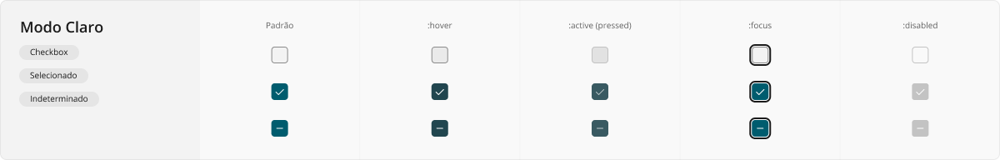
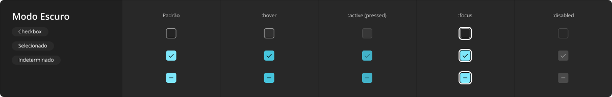
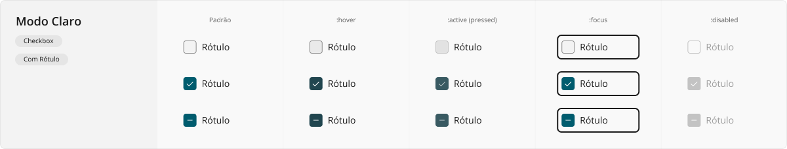
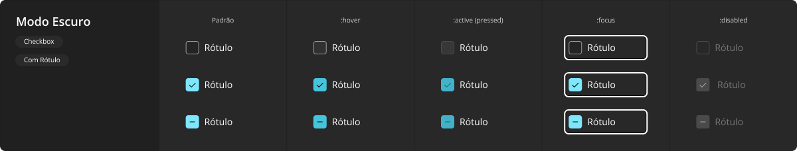
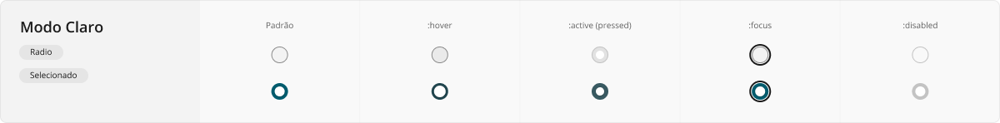
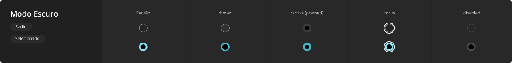
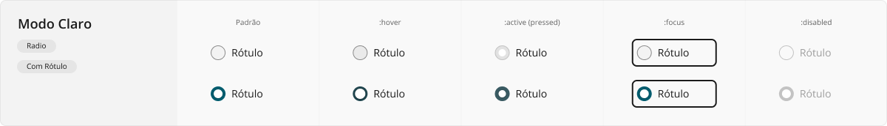
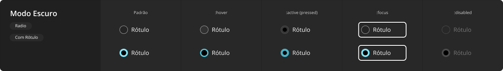

# CheckField

Os campos de seleção oferecem aos usuários uma maneira de selecionar um ou mais itens de um grupo, quando em seu formato de caixa de seleção (_checkbox_), ou alternar entre opções mutuamente exclusivas, quando em seu formato de botão de opção (_radio_).

São elementos frequentemente utilizados em diversas situações, como listas de opções em formulários, questionários, telas de configuração, dentre outros cenários diversos.

<LinkToCpsElements name="checkbox" />

Em inglês, os botões de opção são chamados de _radio buttons_ pois foram inspirados nos botões físicos de aparelhos de rádio antigos, onde havia botões para alternar entre estações de rádio pré-definidas. Ao se pressionar um botão, outro que estivesse pressionado antes "saltava" de volta para fora, para seu estado não selecionado. Este comportamento é metaforicamente percebido em grupos de botões de opção em interfaces digitais.

<LinkToCpsElements name="radio" />

## Variações

Este componente pode ser utilizado conforme as variações descritas a seguir.

### Checkbox Avulso

Esta variação possui visual e comportamento idênticos ao elemento nativo `<input type="checkbox" />` do HTML, ou seja, quando em grupo, vários destes podem estar marcados ou desmarcados ao mesmo tempo. Além disso, em situações como tabelas com linhas selecionáveis, eventualmente a situação de seleção da linha de cabeçalho é indeterminada (pois algumas linhas do corpo da tabela podem estar selecionadas, enquanto outras não estão), sendo que nestes casos mais pontuais o visual do estado indeterminado é utilizado.

A aparência desta variação em modo claro:

A aparência desta variação em modo escuro:

### Checkbox com Rótulo

Esta variação conta com um rótulo de texto informativo junto à caixa de seleção, o qual faz parte da ação do componente, ou seja, recebe foco em conjunto e, quando clicado ou tocado, marca ou desmarca a caixa vinculada (sempre de forma alternada, assim como ocorre ao se acionar diretamente a caixa).

A aparência desta variação em modo claro:

A aparência desta variação em modo escuro:

### Radio Avulso

Esta variação possui visual e comportamento idênticos ao elemento nativo `<input type="radio" />` do HTML, ou seja, quando em grupo, apenas um destes pode estar marcados ao mesmo tempo. Como sempre haverá somente um elemento marcado em meio a outros desmarcados, não há situações indeterminadas como ocorre na variação _checkbox_.

A aparência desta variação em modo claro:

A aparência desta variação em modo escuro:

### Radio com Rótulo

Esta variação conta com um rótulo de texto informativo junto ao botão de opção, o qual faz parte da ação do componente, ou seja, recebe foco em conjunto e, quando clicado ou tocado, marca o botão vinculado (assim como ocorre ao se acionar diretamente o botão de opção).

A aparência desta variação em modo claro:

A aparência desta variação em modo escuro:

## Boas práticas

Para que este componente seja utilizado da melhor maneira possível, observe as práticas a seguir.

### Exibição e comportamento

Sobre como escolher quando usar caixas de seleção ou botões de opção:
- Use uma única caixa de seleção (_checkbox_) quando houver apenas uma seleção a fazer ou escolha a confirmar, por exemplo, confirmar o aceite a termos de uso durante o cadastro em uma aplicação. Marcar a caixa de seleção em branco a seleciona, acioná-la novamente desmarca a caixa de seleção.
- Use várias caixas de seleção (_checkbox_) quando uma ou mais opções puderem ser selecionadas em um grupo. Ao contrário dos botões de opção, selecionar uma caixa de seleção não desmarcará outra caixa de seleção do grupo.
- Nunca utilize um botão de opção (_radio_) sozinho, apenas em grupo, pois ao contrário da caixa de seleção que pode ser marcada e desmarcada individualmente, o botão de opção marcado nunca é desmarcado ao ser acionado novamente, sendo desmarcado somente se estiver em grupo e outro for acionado.
- Use vários botões de opção (_radio_) quando exclusivamente uma opção puder ser selecionada em um grupo. Ao contrário das caixas de seleção, selecionar um botão de opção desmarcará outro botão de opção do grupo.

Separe claramente diferentes grupos deste componente, usando títulos de grupo diretos e precisos, para que o usuário compreenda claramente quais opções selecionáveis referem àquela informação descrita pelo título do grupo.

Tanto os títulos de grupos quanto o rótulo dos elementos que estiverem usando a variação com rótulo devem ser grafados em notação _Sentence case_, conforme explanado em [Tipografia](../guia-visual/tipografia.md#regras-de-formatação), exceto para casos pontuais de nomes próprios, siglas e abreviações amplamente conhecidas, conforme também apresentado nas regras de formatação tipográficas.

Sempre que possível, utilize apenas uma fatia de sentença como rótulo de cada caixa de seleção ou botão de opção, ao invés de uma sentença completa. Por exemplo, ao invés de botões de opção com rótulos `"Eu gosto mais de inverno."` e `"Eu gosto mais de verão."` prefira um título como `"Clima de sua preferência"` e rótulos simples e diretos como `"Inverno"` e `"Verão"`, inclusive sem usar pontuação ao final de cada rótulo, visto que não é uma frase completa.

### Acessibilidade

Por ser um componente acionável pelo usuário, exige-se que todos os diferentes estados de interação sejam adequadamente abordados quando em uso: `:hover` para movimentação do _mouse_ sobre o componente, `:active` para o exato momento em que se encontra pressionado ou tocado (no caso de uma tela sensível ao toque), `:focus` para quando a tela está sendo navegada através de teclado (normalmente pela tecla <kbd>Tab</kbd>), e `:disabled` evidentemente para quando se encontra desabilitado e não pode ser acionado.
