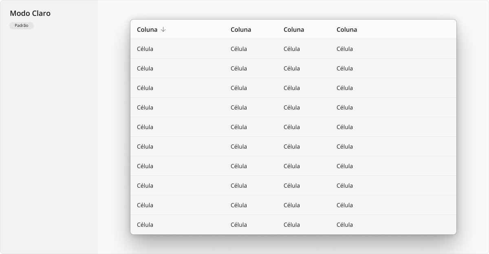
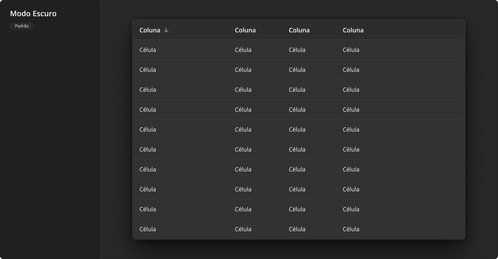
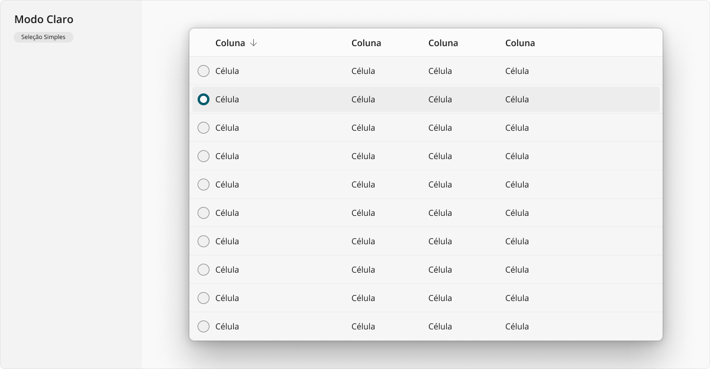
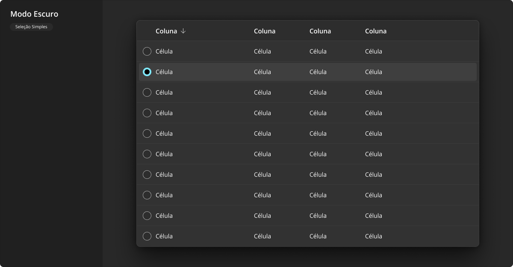
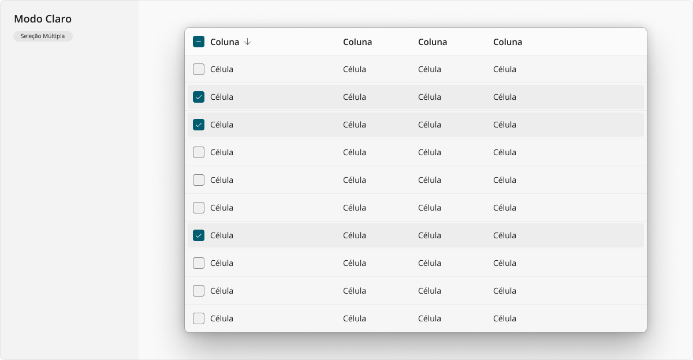
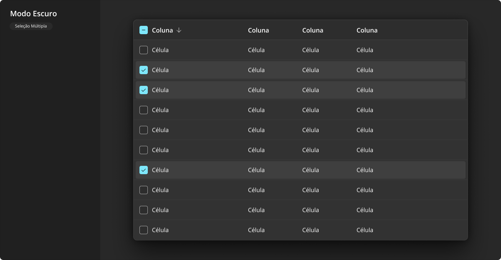

# DataTable

Uma tabela de dados (_data table_) é uma maneira robusta de exibir uma coleção de itens rica em informações, e permitir que as pessoas naveguem e ordenem o conteúdo. É um dos componentes mais comuns em sistemas corporativos para apresentação de dados cadastrados previamente, por permitir apresentar grande quantidade de informações de forma condensada no clássico visual tabular (tabela com colunas e linhas).

Assim, suar uma tabela de dados é conveniente quando a densidade das informações for crítica e o espaço disponível para apresentar todas as colunas for adequado (ainda que usando barra de rolagem horizontal). Isso significa que, em resoluções menores do que _tablets_, costuma ser inviável utilizar tal componente, sendo que as soluções comuns envolvem dinamicamente ocultar parte das informações não essenciais na tabela, ou ainda alternar para outras opções de _layout_, como [ListView](./list-view.md) e [GridView](./grid-view.md).

## Variações

Este componente pode ser utilizado conforme as variações descritas a seguir.

### Padrão

A variação padrão deste componente é recomenda para apresentação tabular de dados estáticos, oferecendo apenas o comportamento de ordenação a partir da ação em um cabeçalho da coluna desejada, porém sem oferecer qualquer ação a partir da interação com as linhas da tabela.

A aparência desta variação em modo claro:

A aparência desta variação em modo escuro:

### Seleção Simples

Esta variação é similar à variação padrão em relação ao comportamento de ordenação a partir do cabeçalho de cada coluna, porém também acrescenta a interação com as linhas da tabela, as quais passam a ser acionáveis tanto através de navegação por teclado quanto por clique/toque. De fato, nesta variação, cada linha da tabela se comporta de maneira muito similar a um item de [ListView](./list-view.md) padrão onde apenas uma linha da tabela pode estar selecionada em determinado momento, visualmente se utilizando de um [CheckField](./check-field.md#radio-avulso) em estilo "_radio_ avulso" como primeira coluna da tabela, para reforçar visualmente o item atualmente selecionado, quando houver.

A aparência desta variação em modo claro:

A aparência desta variação em modo escuro:

### Seleção Múltipla

Esta variação é similar à variação com seleção simples, porém como o nome já indica, acrescenta a possibilidade de seleção de múltiplas linhas ao mesmo tempo, visualmente se utilizando de um [CheckField](./check-field.md#checkbox-avulso) em estilo "_checkbox_ avulso" como primeira coluna da tabela, para reforçar visualmente que vários itens podem estar selecionados simultaneamente. Além disso, outra característica única desta variação é a existência do campo de seleção também no cabeçalho, o qual serve como atalho para selecionar ou remover a seleção de todas as linhas visíveis da tabela, em uma única ação.

A aparência desta variação em modo claro:

A aparência desta variação em modo escuro:

## Boas práticas

Para que este componente seja utilizado da melhor maneira possível, observe as práticas a seguir.

### Exibição e comportamento

Uma tabela de dados precisa conter, no mínimo, três colunas para se tornar justificável. Menos do que isso poderia ser melhor apresentado simplesmente com um [ListView](./list-view.md) utilizando-se de duas linhas de texto em cada item.

Textos dos cabeçalhos da tabela devem ser grafados em notação _Sentence case_, conforme explanado em [Tipografia](../guia-visual/tipografia.md#regras-de-formatação).

Use uma tabela estática, a variação padrão deste componente, somente quando não houverem ações atreladas à tabela. Por exemplo, não existir ações de incluir, editar e/ou excluir registros associadas à tabela em questão. Caso tais ações façam parta das necessidades do _layout_ geral desta tela, prefira uma tabela com seleção simples.

Use uma tabela com seleção simples sempre que houverem ações contextuais conforme o item da tabela atualmente selecionado, por exemplo, nas clássicas interfaces de _CRUD_ (_Create, Read, Update, Delete_, ou seja, nas clássicas telas de criação, leitura, atualização e exclusão de dados).

Este _design system_ recomenda fortemente que não existam ações alternativas nas linhas da tabela, além da ação de selecionar/de-selecionar a linha. Ou seja, desaprova-se fortemente usar botões, campos de texto, ou qualquer outro componente acionável dentro das células, pois a interação nestes elementos conflitaria com a ação da própria linha, causando péssima usabilidade conflitante. Prefira botões claramente separados da tabela, contextualmente referentes à linha selecionada, sendo condicionalmente exibidos/ocultos ou habilitados/desabilitados conforme a seleção das linhas da tabela é alternada.

Use uma tabela com seleção múltipla em casos mais raros, quando ações em lote forem necessárias em determinada interface, por exemplo, alterar campos em comum entre várias registros (como uma recategorização em massa de registros) ou exportar conjuntos de registros selecionados (como uma exportação de linhas selecionadas em outro formato, comumente `.csv` ou `.pdf`).

Em teoria, não haveria limite de quantidade de linhas ou colunas possivelmente exibidas em uma tabela de dados, desde que o _container_ onde a tabela está inserida exiba barras de rolagem, caso necessário. Porém, para fins de manter sempre em exibição os cabeçalhos da tabela e os dados de sua primeira coluna textual, pode ser relevante mantê-los tais elementos com posição estática, caso se opte por utilizar barras de rolagem na própria tabela ao invés de exibir em seu _container_.

Em cenários onde exibir centenas, ou mesmo milhares de linhas for necessário, carregar todas de uma vez pode ser totalmente inviável, tanto em usabilidade quanto em desempenho da interface para o usuário final (pois esta irá demorar mais para carregar inicialmente, além de se tornar sobrecarregada durante a interação, dado o grande número de elementos em memória no navegador ao mesmo tempo). Para evitar tal problema típico, este _design system_ recomenda limitar a quantidade máxima de linhas exibida nas tabelas e recorrer a abordagens de paginação, utilizando-se o componente [Pagination](./pagination.md) após a tabela.

### Acessibilidade

A tabela em si não é um elemento acionável pelo usuário e, portanto, não possui características especiais acessibilidade. Por outro lado, cada item de cabeçalho da tabela que possuir a capacidade de mudar a ordenação da tabela, bem como cada linha da tabela para tabelas com seleção simples ou múltipla de linhas, são essencialmente sub-componentes acionáveis pelo usuário, os quais comportam-se de forma similar a botões, exigindo todos os diferentes estados de interação adequadamente abordados quando em uso: `:hover` para movimentação do _mouse_ sobre o sub-componente, `:active` para o exato momento em que se encontra pressionado ou tocado (no caso de uma tela sensível ao toque), `:focus` para quando a tela está sendo navegada através de teclado (normalmente pela tecla <kbd>Tab</kbd>), e `:disabled` evidentemente para quando se encontra desabilitado e não pode ser acionado.
