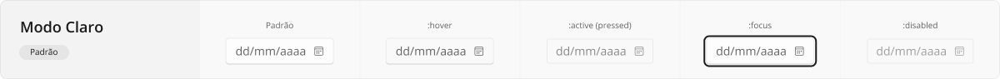
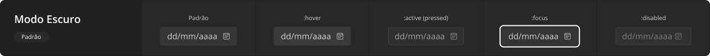
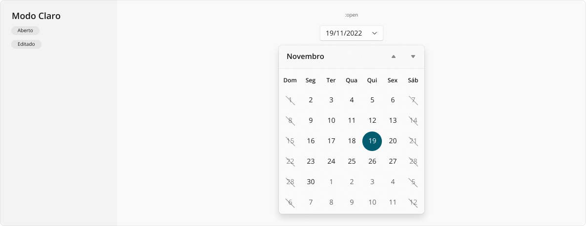
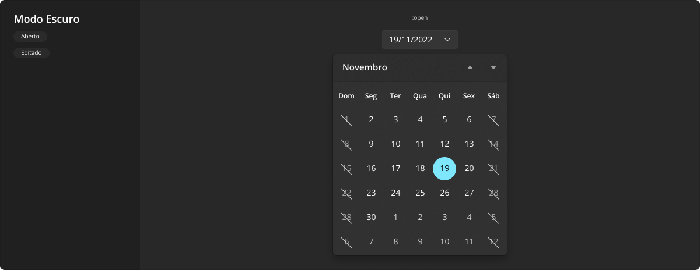

# DateField

Um campo seletor de data (_date field_) é um tipo de componente de entrada de dados que apresenta um calendário flutuando quando aberto. Componente normalmente usado em formulários, evidentemente para entrada de datas.

Vale ressaltar que campos de seleção de datas atuam da mesma forma que outros campos de entrada de dados em um formulário, portanto também podem exibir rótulo antes da caixa, e também devem reagir a estado `:invalid` caso não passem por alguma validação de dados na tela, todos os mesmos comportamentos descritos para o [TextField](./text-field.md).

<LinkToCpsElements name="input">
  
Embora ele não tenha sido especificamente criado para atender esta especificação de <i>date field</i>, utilizá-lo com <code>type</code> igual a <code>date</code>, <code>datetime-local</code>, <code>time</code> ou <code>week</code> deve atender às necessidades mais comuns.

</LinkToCpsElements>

## Variações

Este componente pode ser utilizado conforme as variações descritas a seguir.

### Padrão

A variação padrão deste componente representa seu estado de repouso, oferecendo acesso imediato à sua ação principal ao ser acionado, exibindo-se o menu flutuante com o calendário a partir da ação.

A aparência desta variação em modo claro:

A aparência desta variação em modo escuro:

### Aberto

Esta variação é acessada sempre que o componente é acionado. É importante considerar que o menu flutuante com o calendário é aqui exibido meramente como referência de posicionamento em relação ao campo seletor de data, visto que a documentação detalhada destas peças de interface encontram-se em [MenuFlyout](./menu-flyout.md) e [Calendar](./calendar.md).

A aparência desta variação em modo claro:

A aparência desta variação em modo escuro:

## Boas práticas

Para que este componente seja utilizado da melhor maneira possível, observe as práticas a seguir.

### Exibição e comportamento

Use um campo seletor de data, evidentemente, quando o usuário precisa preencher uma data sem tomar muito espaço da interface para tal, visto que em estado de repouso este componente ocupa o mesmo espaço que uma caixa de texto comum. Quando espaço não for um problema, uma alternativa é contar com o calendário diretamente na interface, através do componente [Calendar](./calendar.md) apresentado continuamente, sem o uso do campo seletor.

Grande parte das questões de _layout_ já abordadas no componente [TextField](./text-field.md) também são válidas para este, como: não redimensionar a caixa verticalmente, não colocar o campo em meio a frases, incluir rótulo (_label_) conforme necessário, reagir a diferentes estados de validação de dados, seguir notação _Sentence case_ conforme explanado em [Tipografia](../guia-visual/tipografia.md#regras-de-formatação).

Quando não preenchido com uma data, seu texto de espaço reservado (_placeholder_) apresenta um indicativo de que tal informação é ali esperada, usando-se uma máscara com o formato de data a ser utilizado quando estiver preenchido (comumente `dd/mm/aaaa`, sendo `d` para dia, `m` para mês e `a` para ano).

### Acessibilidade

Por ser um componente acionável pelo usuário, exige-se que todos os diferentes estados de interação sejam adequadamente abordados quando em uso: `:hover` para movimentação do _mouse_ sobre o componente, `:active` para o exato momento em que se encontra pressionado ou tocado (no caso de uma tela sensível ao toque), `:focus` para quando a tela está sendo navegada através de teclado (normalmente pela tecla <kbd>Tab</kbd>), e `:disabled` evidentemente para quando se encontra desabilitado e não pode ser acionado.

Quando fizer parte de um formulário, deixe claro quais campos são obrigatórios durante a entrada de dados, ativando o correto estado `:invalid` durante o preenchimento. Para leitores de tela, certifique-se de que a propriedade `aria-required="true"` esteja definida no elemento, e que o _label_ correspondente (que serve como título do campo seletor) possua o atributo `for` adequadamente interligado ao `id` do campo.

Sobre a acessibilidade durante a navegação no calendário flutuante aberto, refira-se aos comportamentos de acessibilidade do componente [Calendar](./calendar.md).
