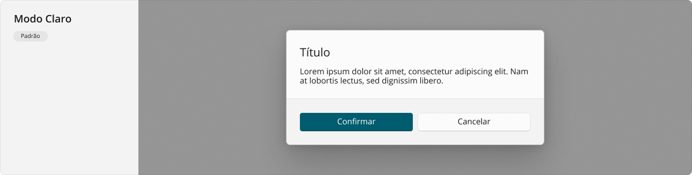
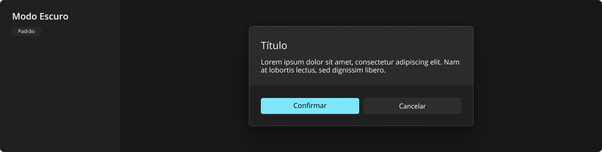
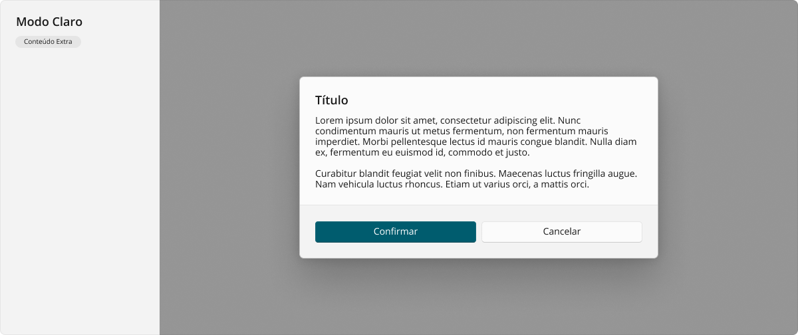
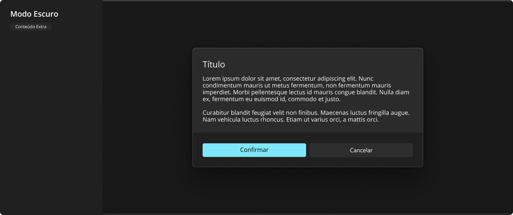
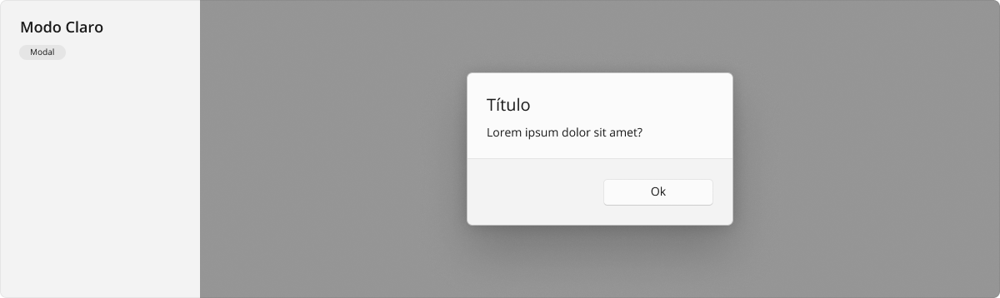
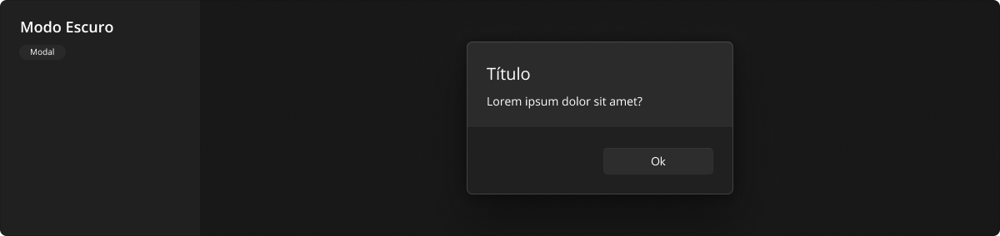

# Dialog

As caixa de diálogo são sobreposições de interface do usuário que fornecem informações contextuais com foco total. Bloqueiam as interações com o restante da página, através da utilização de uma camada de material [esfumaçado](../guia-visual/camadas-e-materiais.md#esfumaçado). Muitas vezes solicitam algum tipo de ação do usuário, como a resposta de uma confirmação.

<LinkToCpsElements name="dialog" />

## Variações

Este componente pode ser utilizado conforme as variações descritas a seguir.

### Padrão

A caixa de diálogo padrão é a variação mais comum, frequentemente utilizada para realizar perguntas ao usuário e para confirmação de ações importantes, como verificar se o usuário realmente deseja sobrescrever ou excluir um registro. A ação de confirmação é desencadeada a partir do acionamento do [Botão de Ênfase](./button.md#ênfase). A ação de cancelamento ocorre tanto a partir do acionamento do outro botão, bem como clicar/tocar no plano de fundo esfumaçado. Em geral, ambos os botões fecham a caixa de diálogo, mas apenas o botão de confirmação realiza alguma operação extra além do fechamento.

A aparência desta variação em modo claro:

A aparência desta variação em modo escuro:

### Conteúdo Extra

Eventualmente, caixas de diálogo podem ser expandidas horizontalmente e verticalmente para apresentarem mais conteúdo, desde que ainda sobre espaço relevante em volta para apresentação do plano de fundo esfumaçado. Caso ainda mais conteúdo seja necessário, a utilização de barra de rolagem vertical especificamente dentro da área de texto do diálogo é uma opção viável.

A aparência desta variação em modo claro:

A aparência desta variação em modo escuro:

### Modal

Em alguns casos extremos, não existe qualquer escolha por parte do usuário, mas este precisa explicitamente confirmar que leu o diálogo. Neste cenário, a variação modal é a opção, contendo apenas um botão `"Ok"` para fechar o diálogo. Nesta variação, clicar/tocar o plano de fundo esfumaçado não fecha o diálogo, pois o usuário precisa explicitamente oferecer a confirmação.

A aparência desta variação em modo claro:

A aparência desta variação em modo escuro:

## Boas práticas

Para que este componente seja utilizado da melhor maneira possível, observe as práticas a seguir.

### Exibição e comportamento

Sempre ofereça um título curto, direto e evidente sobre qual ação exige confirmação por parte do usuário. Além disso, deve ser grafado em notação _Sentence case_, conforme explanado em [Tipografia](../guia-visual/tipografia.md#regras-de-formatação).

O texto de conteúdo do diálogo deve detalhar o que o título iniciou, em frases de fácil compreensão e preferencialmente de forma interrogativa caso estejam perguntando a escolha do usuário.

A caixa de diálogo deve manter uma medida proporcional ao tamanho do _viewport_, deixando algum espaço para o plano de fundo esfumaçado em telas menores, mas também garantindo que não seja demasiadamente grande em telas maiores. Neste caso, é melhor limitar as medidas da caixa de diálogo e manter mais espaço para o plano de fundo esfumaçado do que para a caixa em si.

### Acessibilidade

Quando uma caixa de diálogo está aberta, pressionar <kbd>Enter</kbd> corresponde à ação de confirmação do diálogo.

Quando uma caixa de diálogo está aberta e não é modal, pressionar <kbd>Esc</kbd> corresponde à ação de fechamento sem confirmação do diálogo, assim como ocorre em um _click_/_touch_ no plano de fundo esfumaçado ao redor da caixa.

Caixas de diálogo devem funcionar como uma "armadilha de foco" (_focus trap_), ou seja, utilizar a tecla <kbd>Tab</kbd> enquanto o diálogo está aberto só deve alternar entre os botões disponíveis no diálogo, nunca voltando o foco para qualquer elemento existente na página que está bloqueada por trás do plano de fundo esfumaçado.
