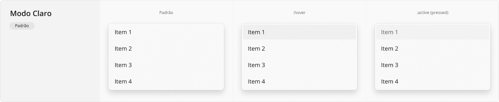
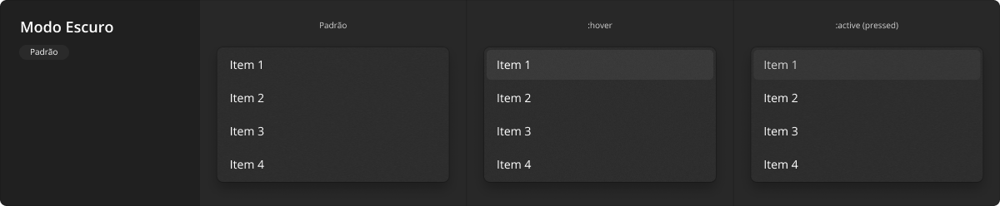
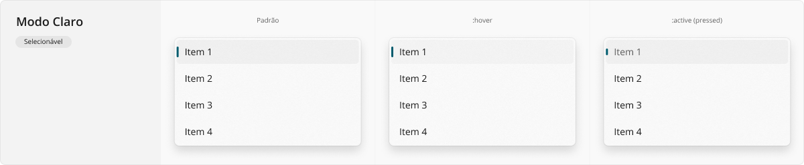
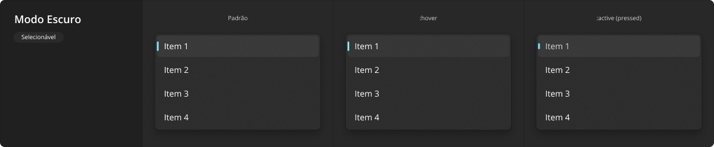
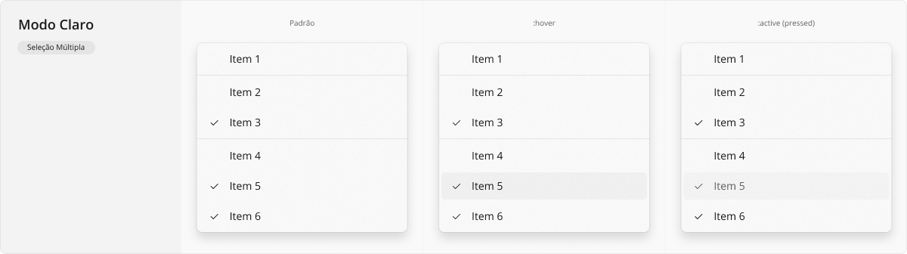
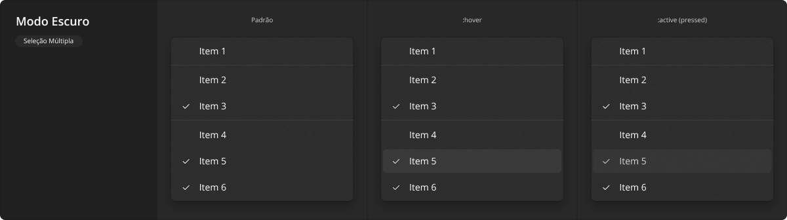

# MenuFlyout

Os menus contextuais são painéis flutuantes, usualmente com listas de comandos, baseados no contexto de exibição, foco do _mouse_ e/ou foco do teclado. Eles são uma das áreas de comandos mais eficazes e largamente utilizadas, aparecendo em vários lugares de uma aplicação, desde listas de opções dentro de caixas de seleção, a menus de contexto personalizados acionados ao clicar-se com o botão direito do _mouse_.

<LinkToCpsElements name="menu">
  
Vale ressaltar que, embora visualmente o componente <code>CpsMenu</code> atenda diretamente esta documentação, para que seja utilizado como menu de contexto acionado por outros elementos, é relevante visitar também a documentação sobre o utilitário <a href="https://cpsrepositorio.github.io/cps-elements/#/utilitários/flyout" target="_blank" rel="noopener noreferrer" style="margin-right: 0.25rem">CpsFlyout <svg xmlns="http://www.w3.org/2000/svg" aria-hidden="true" focusable="false" x="0px" y="0px" viewBox="0 0 100 100" width="15" height="15" class="icon outbound"><path fill="currentColor" d="M18.8,85.1h56l0,0c2.2,0,4-1.8,4-4v-32h-8v28h-48v-48h28v-8h-32l0,0c-2.2,0-4,1.8-4,4v56C14.8,83.3,16.6,85.1,18.8,85.1z"></path> <polygon fill="currentColor" points="45.7,48.7 51.3,54.3 77.2,28.5 77.2,37.2 85.2,37.2 85.2,14.9 62.8,14.9 62.8,22.9 71.5,22.9"></polygon></svg> (opens new window)</a>.

</LinkToCpsElements>

## Variações

Este componente pode ser utilizado conforme as variações descritas a seguir.

### Padrão

O menu contextual padrão é a variação mais recorrente em uma aplicação, sendo composto por um conjunto de comandos acionáveis ao serem clicados. Os items da lista podem ser meramente textuais como no exemplo aqui apresentado, mas também podem conter ícone antes do texto, seguindo as mesmas recomendações de ícones com texto existente em [Button](./button.md).

A aparência desta variação em modo claro:

A aparência desta variação em modo escuro:

### Selecionável

Esta variação é utilizada quando um dos itens da lista de comandos existente dentro do menu é selecionável, como ocorre em [DropdownField](./dropdown-field.md) e [DropdownButton](./dropdown-button.md). Os itens não selecionados permanecem seguindo a variação padrão apresentada acima, sendo que o que muda nesta variação é o visual específico do item atualmente selecionado. Assim como na anterior, os itens podem ser puramente textuais, ou utilizar ícones junto ao texto.

A aparência desta variação em modo claro:

A aparência desta variação em modo escuro:

### Seleção Múltipla

Esta variação é utilizada com menos frequência e possui uma usabilidade mais complexa, pois o menu de contexto não deve ser fechado automaticamente quando um item é acionado, o que ocorreria nas variações anteriores. Neste caso, é possível selecionar e de-selecionar os itens enquanto o menu de contexto permanece aberto.

A aparência desta variação em modo claro:

A aparência desta variação em modo escuro:

## Boas práticas

Para que este componente seja utilizado da melhor maneira possível, observe as práticas a seguir.

### Exibição e comportamento

Quando o menu é baseado em listas de comandos, sugere-se que estes sejam divididos em grupos conforme a temática. Isso ajuda os usuários a se lembrarem dos locais em que os comandos ficam ou encontrarem comandos menos usados, ​​com base na proximidade de outros.

No caso de listas de comandos com seleção múltipla, deve-se também agrupar conjuntos de opções mutuamente exclusivas ou múltiplas selecionáveis.

Evite submenus de menus de contexto, pois eles podem ser difíceis de invocar ou de se lembrar, e oferecem uma usabilidade muito pobre em dispositivos móveis, precisando abrir por cima do menu de contexto principal.

### Acessibilidade

Caso o menu seja composto por uma lista de comandos com itens selecionáveis, é importante garantir que as teclas de setas <kbd>&uarr;</kbd> e <kbd>&darr;</kbd> alternem a seleção dos elementos anteriores e posteriores ao atual, respectivamente.

Caso seja seleção simples, pressionar <kbd>Enter</kbd> com a lista suspensa aberta confirma a seleção, automaticamente fechando-a e colocando o item que estava marcado/focado como a nova opção selecionada.

Caso seja seleção múltipla, pressionar <kbd>Enter</kbd> apenas seleciona ou de-seleciona o item marcado/focado, mantendo-se o menu visível até que uma ação de fechamento explícita ocorra.

Menus contextuais devem ser fechados sempre que um _click_/_touch_ ocorrer no conteúdo em volta de si, fora de sua área interna. Também devem ser fechados se a tecla <kbd>Esc</kbd> for pressionada enquanto estão abertos.
