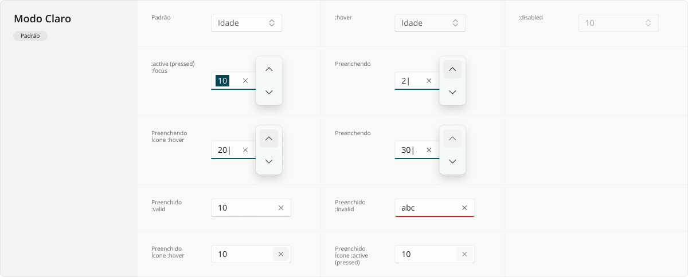
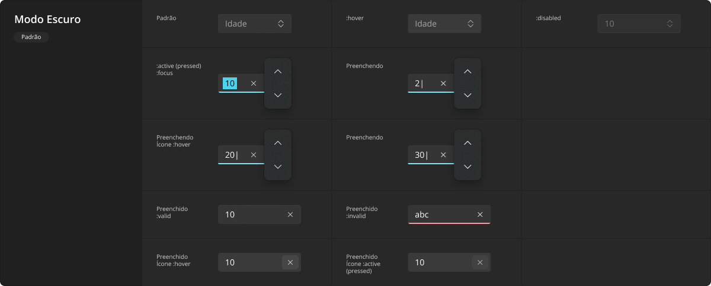

# NumberField

Um caixa numérica é uma espécie de variação do [TextField](./text-field.md) comum, mas com comportamento tão específico que merece ser documentada à parte. Trata-se de uma caixa de texto especificamente preparada apenas para entrada de valores numéricos, exibindo botões para agilizar incrementar ou decrementar o valor durante a edição.

Este componente não é relevante somente para exibição e edição de números inteiros, podendo também ser adaptado à utilização para números com casa decimal, cabendo ao desenvolvedor definir o `step` dos valores a cada utilização dos botões de incremento e decremento conforme a funcionalidade que mais puder agregar à usabilidade. Isto é, mantendo incrementos e decrementos em de um em um, ou utilizando incrementos e decrementos nas casas decimais.

<LinkToCpsElements name="input">
  
Assim como uma caixa de entrada nativa, este componente é ajustado para atender tal caso de uso, bastando utilizá-lo com <code>type</code> igual a <code>number</code>.

</LinkToCpsElements>

## Variações

Este componente não exige a documentação de variações, apenas se adaptando ao modo de cor em uso.

A aparência em modo claro:

A aparência em modo escuro:

## Boas práticas

Para que este componente seja utilizado da melhor maneira possível, observe as práticas a seguir.

### Exibição e comportamento

Grande parte das considerações de _layout_ do [TextField](./text-field.md) comum também se aplicam, com exceção do uso de máscara de formatação de valores, o que poderia gerar grande confusão sobre a funcionalidade dos botões de incremento e decremento. Ou seja, este componente só deve apresentar em seu valor números de `0` a `9`, sinal de número negativo (`-`) e casa de número decimal (`,`).

### Acessibilidade

Por ser um componente acionável pelo usuário, exige-se que todos os diferentes estados de interação sejam adequadamente abordados quando em uso: `:hover` para movimentação do _mouse_ sobre o componente, `:active` para o exato momento em que se encontra pressionado ou tocado (no caso de uma tela sensível ao toque), `:focus` para quando a tela está sendo navegada através de teclado (normalmente pela tecla <kbd>Tab</kbd>), e `:disabled` evidentemente para quando se encontra desabilitado e não pode ser acionado.

Estendendo sobre a navegação por teclado, reforça-se que deve diferenciar a caixa de texto em si dos botões de incremento e decremento, ou seja, cada botão deve receber o estado `:focus` de teclado individualmente, para poder ser acionada pela tecla <kbd>Enter</kbd> também individualmente. Além disso, quando a caixa de texto está com foco de teclado, as teclas de setas <kbd>&uarr;</kbd> e <kbd>&darr;</kbd> devem acionar o comportamento dos botões de incrementar e decrementar, respectivamente.

Quando fizer parte de um formulário, deixe claro quais campos são obrigatórios durante a entrada de dados, ativando o correto estado `:invalid` durante o preenchimento. Para leitores de tela, certifique-se de que a propriedade `aria-required="true"` esteja definida no elemento, e que o _label_ correspondente (que serve como título da caixa de texto) possua o atributo `for` adequadamente interligado ao `id` do campo.
