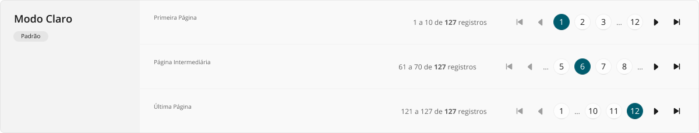
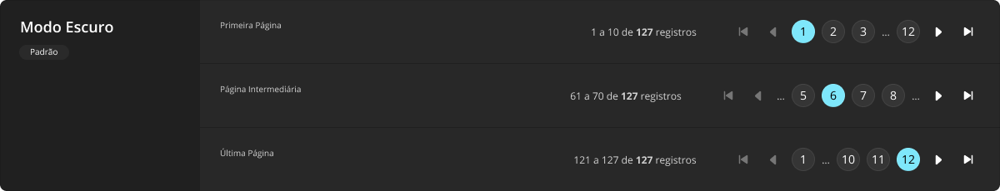

# Pagination

Paginação (_pagination_) é um componente comum em sistemas corporativos, especialmente sendo usado em parceria com o [DataTable](./data-table.md), por vezes até sendo encarado como parte deste.

Entretanto, neste _design system_, optou-se por considerar um componente à parte, visto que poderia ser empregado em outras situações, bem como as tabelas de dados em si também podem ser utilizadas sem paginação em alguns cenários.

## Variações

Este componente não possui variações, apenas se adaptando ao modo de cor em uso.

A aparência deste componente em modo claro:

A aparência deste componente em modo escuro:

## Boas práticas

Para que este componente seja utilizado da melhor maneira possível, observe as práticas a seguir.

### Exibição e comportamento

A paginação funciona como um _wrapper_ de elementos e componentes:
- Um rótulo de texto descrevendo quais registros (normalmente de um [DataTable](./data-table.md) acima da paginação) estão em exibição no momento, bem como o total geral de registros existentes independentemente de quanto estão em exibição.
- Botões de navegação para a primeira página de registros e para a página anterior à atualmente selecionada, sendo estes instâncias de componente [Button](./button.md#ícone) em sua variação apenas com ícone.
- Botões de alternância numerados representando páginas especificas de registros que pode ser acessadas diretamente, sendo estes instâncias de componente [ToggleButton](./toggle-button.md).
- Botões de navegação para a próxima página à atualmente selecionada e para a última página de registros, sendo estes instâncias de componente [Button](./button.md#ícone) em sua variação apenas com ícone.

Não é recomendado apresentar mais do que quatro botões de alternância para trocar de página ao mesmo tempo. Por isso, utiliza-se de rótulos com elipses (`...`) para demonstrar intervalos de páginas não sendo exibidos no momento.

O intervalo de páginas em exibição é dinâmico, de acordo com a página atualmente selecionada. Especialmente quando a primeira página está ativa, as páginas de `1` a `3` mais a última (`n`) são apresentadas. Especialmente quando a última página está ativa, as páginas de `n-2` a `n` mais a primeira (`1`) são exibidas. Em todos os outros casos, rótulos com elipses demonstram a existância de páginas antes e depois do grupo de página em exibição, limitado a quatro páginas.

Em resoluções menores, pode não ser possível apresentar o rótulo de quantidade de registros exibidos e total antes da sequência de botões de ação para paginação. Nestes casos, recomenda-se inverter o rótulo e a paginação propriamente dita, para reposicionar o rótulo abaixo dos botões de paginação.

### Acessibilidade

A paginação em si não é um elemento acionável pelo usuário e, portanto, não possui características especiais acessibilidade. Porém, cada [Button](./button.md#ícone) e [ToggleButton](./toggle-button.md) da paginação é um sub-componente acionável pelo usuário, exigindo todos os diferentes estados de interação adequadamente abordados quando em uso: `:hover` para movimentação do _mouse_ sobre o sub-componente, `:active` para o exato momento em que se encontra pressionado ou tocado (no caso de uma tela sensível ao toque), `:focus` para quando a tela está sendo navegada através de teclado (normalmente pela tecla <kbd>Tab</kbd>), e `:disabled` evidentemente para quando se encontra desabilitado e não pode ser acionado.
