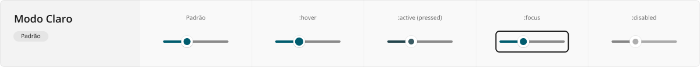
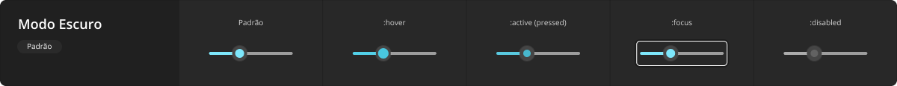

# SliderField

Um campo de controle deslizante é um componente que permite modificar um valor numérico a partir do deslizamento do marcador circular que flutua sobre uma barra horizontal.

Típico em interfaces de configuração baseadas em intervalos de valores, foi fortemente inspirado em controles deslizantes do mundo físico, como painéis de ajuste de velocidade de ventiladores de teto.

## Variações

Este componente não exige a documentação de variações, apenas se adaptando ao modo de cor em uso.

A aparência em modo claro:

A aparência em modo escuro:

## Boas práticas

Para que este componente seja utilizado da melhor maneira possível, observe as práticas a seguir.

### Exibição e comportamento

Este componente não possui qualquer característica de _layout_ em especial, apenas seguindo fundamentalmente os mesmos comportamentos do elemento `<input type="range">` nativo.

### Acessibilidade

Para fins de facilitar a manipulação do valor atual, além da natural interação de clicar/tocar e arrastar, quando este componente tem foco de teclado, as teclas de setas <kbd>&larr;</kbd> e <kbd>&darr;</kbd> devem decrementar o valor em uso deslocando o marcador para trás, enquanto as teclas de setas <kbd>&rarr;</kbd> e <kbd>&uarr;</kbd> devem incrementar o valor em uso deslocando o marcador para frente.

Como este componente não apresenta claramente o valor numérico atualmente em uso, e também não apresenta exatamente os valores que compõe o intervalo inicial e final, recomenda-se fortemente utilizar rótulos explícitos sobre o intervalo e, também, um bloco de texto reativo apresentando o valor em uso em tempo real.
